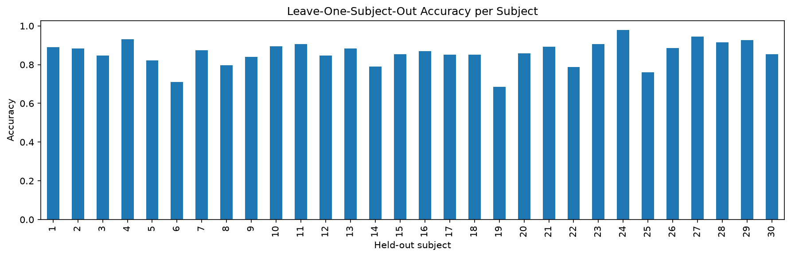
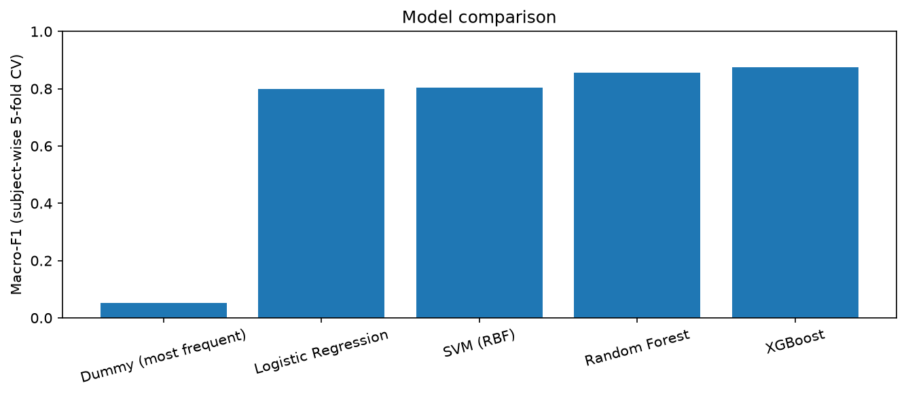
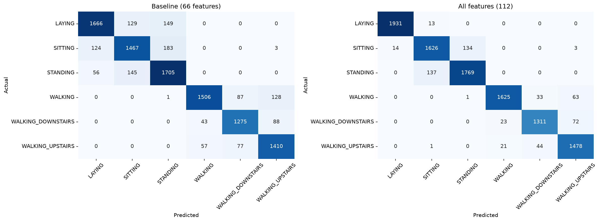

# Human Activity Recognition from Raw Smartphone Sensor Signals

Classifies six activities (walking, walking upstairs, walking downstairs, sitting,
standing, laying) from raw accelerometer and gyroscope windows, using hand-engineered
signal-processing features and classical ML. No pre-extracted dataset features are used.

**Headline result:** 0.944 ± 0.023 macro-F1 (0.946 ± 0.021 accuracy) with XGBoost on
112 engineered features, evaluated with subject-wise 5-fold cross-validation
(no person appears in both train and test). Models were not hyperparameter-tuned.

## Dataset
[UCI HAR Dataset](https://archive.ics.uci.edu/dataset/240/human+activity+recognition+using+smartphones):
30 subjects, waist-mounted smartphone, 50 Hz, 2.56 s windows (128 samples).
The official train/test files were merged (their subjects do not overlap) for cross-validation.

## Approach
1. Explored raw signals visually and statistically to form hypotheses.
2. Engineered features per window: 66 baseline (11 time/frequency features x 6 body
   accelerometer/gyroscope axes), later extended to 112 (see ablation below).
3. Evaluated with subject-independent validation and compared models on identical folds.
4. Used confusion matrices and feature importance to diagnose errors, then tested fixes.

## 1. Evaluation: why subject-wise splitting matters

| Evaluation method | Accuracy (Random Forest, 66 features) |
|---|---|
| Random KFold (same subject in train and test; leaky) | 0.923 ± 0.009 |
| Subject-wise GroupKFold (honest) | 0.855 ± 0.017 |

Windows from one person are highly correlated, so random splitting lets the model
recognize people instead of activities. The ~7-point gap measures that leakage. The
original single 21/9 subject split gave ~88% accuracy, a slightly optimistic draw
compared with the cross-validated estimate.

Leave-one-subject-out accuracy varies between individuals:

[Add min / mean / max from `subject_acc.describe()` here.]

## 2. Model comparison (66 features, subject-wise 5-fold CV, untuned)

| Model | Accuracy | Macro-F1 | SITTING F1 | STANDING F1 | Train (s/fold) | Inference (ms/window) |
|---|---|---|---|---|---|---|
| Dummy (most frequent) | 0.189 ± 0.011 | 0.053 ± 0.003 | 0 | 0 | 0 | 0.0001 |
| Logistic Regression | 0.797 ± 0.022 | 0.800 ± 0.019 | 0.696 | 0.736 | 1.58 | 0.0018 |
| SVM (RBF) | 0.798 ± 0.022 | 0.803 ± 0.019 | 0.667 | 0.739 | 1.03 | 0.4253 |
| Random Forest | 0.855 ± 0.017 | 0.855 ± 0.019 | 0.810 | 0.843 | 1.34 | 0.0383 |
| XGBoost | 0.877 ± 0.012 | 0.876 ± 0.014 | 0.834 | 0.865 | 5.42 | 0.0101 |

XGBoost performed best. Its lead over Random Forest (~2 points) is only one to two fold
standard deviations, so treat the two as close. Linear and kernel models trailed the
tree ensembles by about 6-8 points. Logistic Regression reaching 0.80 shows the
engineered features carry much of the signal.

## 3. Diagnosing errors and testing a fix

The first confusion matrix showed SITTING vs STANDING as the main error pair. A
classifier trained on those two classes alone ranked gyroscope features highest, but
overall the baseline features discarded one physical cue: `body_acc` has gravity
filtered out, so torso orientation was invisible.

Hypothesis: gravity-orientation features from `total_acc` would help. The mean
window tilt supports it (SITTING and STANDING differ by about 17 degrees in y-tilt):

| | tilt_y (deg) | tilt_z (deg) |
|---|---|---|
| SITTING | 82.5 | 81.5 |
| STANDING | 99.2 | 91.1 |

Feature ablation (XGBoost, same subject-wise folds):

| Config | Features | Macro-F1 | SITTING F1 | STANDING F1 | Sit<->Stand errors |
|---|---|---|---|---|---|
| Baseline | 66 | 0.876 ± 0.014 | 0.834 | 0.865 | 328 |
| + Gravity | 72 | 0.913 ± 0.022 | 0.908 | 0.925 | 283 |
| + Magnitude/Correlation | 76 | 0.896 ± 0.012 | 0.861 | 0.887 | 278 |
| + Frequency | 96 | 0.904 ± 0.018 | 0.858 | 0.880 | 283 |
| All new features | 112 | 0.944 ± 0.023 | 0.915 | 0.929 | 271 |

Paired per-fold comparison (identical folds): macro-F1 improved in 5/5 folds, with
gains of +0.052 to +0.100 (mean +0.068).

Where the gains came from (counts read from the confusion matrices; approximate):
laying confused with sitting/standing dropped from roughly 458 to roughly 27 windows,
and confusion within the three walking classes roughly halved. Sitting vs standing
improved only modestly (328 to 271 confused windows).

## Limitations
- Sitting vs standing remains the largest error source; a single waist sensor has limited
  information about hip angle.
- Gravity features assume the phone is worn the same way across subjects. A different
  mounting would shift them.
- Models were not hyperparameter-tuned. The feature ablation attributes gains to feature
  groups, but I have not isolated individual features.
- Results are from one dataset with 30 subjects.

## Repository structure
- `src/Features.py`: baseline 11-feature extractor (per-window)
- `notebooks/exploration_and_modeling.py`: full analysis, including the extended
  features and all experiments (run cell by cell; set `DATA_PATH` at the top)
- `reports/`: plots and result tables
- `train_features.csv`, `test_features.csv`: generated baseline feature tables

## How to run
1. Download the dataset and set `DATA_PATH` in the script.
2. `pip install -r requirements.txt` (also needs `xgboost` and `tabulate`; add them to the file).
3. Run `notebooks/exploration_and_modeling.py` cell by cell.

## Next steps
- Hyperparameter tuning with grouped cross-validation
- Move the extended features into `src/` and add a training script and tests
- Test generalization on self-collected ESP32 + MPU6050 data
