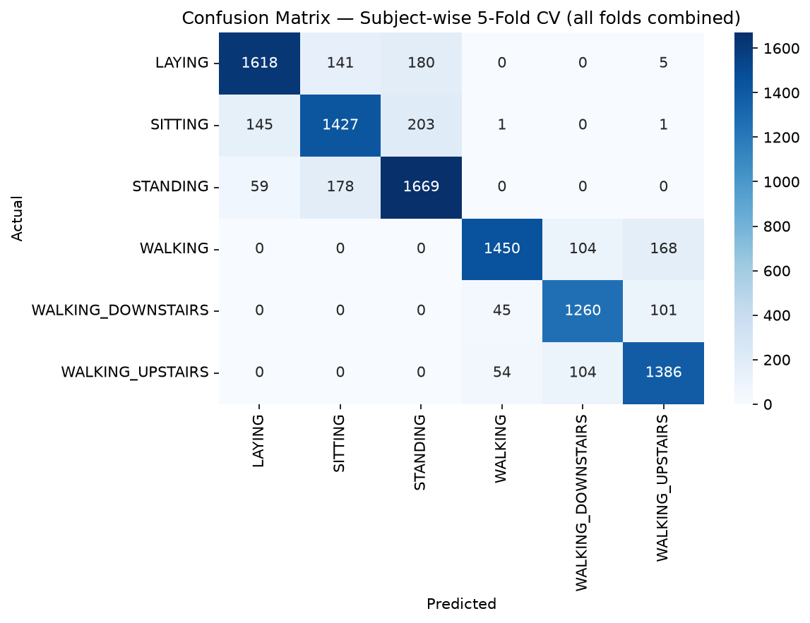

# Human Activity Recognition from Smartphone Sensor Data

## Problem Statement
Classify human activities (walking, sitting, standing, laying, walking up/down stairs) 
from raw accelerometer and gyroscope signals, using engineered signal-processing 
features and classical machine learning — built from raw signals, not pre-extracted 
dataset features.

## Dataset
UCI HAR Dataset — 30 subjects, waist-mounted smartphone, 6 activities, 
50Hz tri-axial accelerometer and gyroscope data. [link to dataset]

## Approach
1. Explored raw signal patterns manually to form hypotheses about discriminating 
   features (see notebooks/01_signal_exploration.ipynb)
2. Engineered 11 time- and frequency-domain features per axis (66 features total) 
   from raw windowed signals — no pre-extracted dataset features used
3. Trained and evaluated a Random Forest classifier using the dataset's official 
   subject-independent train/test split
4. Performed feature importance analysis to validate hypotheses and explain model behavior

## Key Results
- Overall F1-scores ranging 0.82–0.91 across 6 activity classes
- [confusion matrix image here]
- Static vs. dynamic activities perfectly separated (0 misclassifications)
- STANDING vs SITTING was the primary confusion pair — confirmed by manual signal 
  analysis before modeling

## Key Finding: Gyroscope Dominates Standing vs Sitting Classification
[Insert your feature importance chart here]
Manual exploration suggested gyroscope data might better separate standing from 
sitting than accelerometer data, since standing involves continuous postural 
balance correction (small rotational adjustments) that sitting does not. This was 
confirmed: a focused classifier trained only on standing vs sitting examples 
ranked gyroscope-derived features (particularly body_gyro_x_std) as overwhelmingly 
the most important, while accelerometer features — dominant in the overall 
6-class model — contributed comparatively little to this specific distinction.

## Evaluation: subject-independent cross-validation

A single train/test split (9 test subjects) gave ~88% accuracy, but with so few
subjects the estimate is noisy. I combined all 30 subjects and evaluated with
subject-wise 5-fold cross-validation (GroupKFold, no subject appears in both
train and test).

| Evaluation method | Accuracy |
|---|---|
| Random KFold (leaky: same subject in train and test) | 92.3% ± 0.9 |
| Subject-wise GroupKFold (honest) | 85.5% ± 1.7 |

The ~7-point gap quantifies data leakage from subject identity. Leave-one-subject-out
evaluation shows accuracy varies noticeably between individuals:

## How to Reproduce
1. Download UCI HAR Dataset from [link]
2. `pip install -r requirements.txt`
3. Run `src/train_model.py`

## Future Work
- Collect custom sensor data via ESP32 + MPU6050 and test model generalization 
  to a different sensor/subject setup
- Add gravity-axis orientation features to further address standing/sitting confusion
- Explore deep learning approaches (1D-CNN/LSTM) as a comparison baseline
